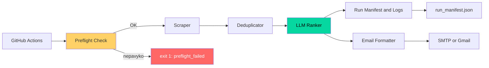

# Darbo paieškos agentas (Playwright + Claude API)


| Metric | Value |
|---|---|
| Python | ~1 840 LOC (be testų) |
| Tests | 173 |
| Coverage | 92.9% |
| Sources | Configurable (`sources.yaml`) |
| LLM | Claude, Tool Use |
| Parallel scraping | 3 sources |
| CI | GitHub Actions |

> 📌 **Pastabos, aktualios ir po publikavimo:**
> - Jei naudosite `sources.local.yaml` su realiais šaltiniais, patikrinkite jų
>   `robots.txt`/Paslaugų teikimo sąlygas (žr. `SECURITY.md`)
> - Būkite pasiruošę paaiškinti **savo** architektūrinius sprendimus, ne tik kaip kodas veikia

## Greita apžvalga

**LLM-assisted job search automation** (AI-powered job matching workflow) —
naršo darbo skelbimų svetaines (Playwright), įvertina kiekvieno skelbimo
atitikimą kandidato profiliui per Claude API su struktūrizuota, validuojama
išvestimi, ir atsiunčia santrauką el. paštu — pilnai automatizuotas per
GitHub Actions.

**Šis projektas paruoštas viešam repo/portfolio naudojimui** — pagal numatytąją
konfigūraciją asmeniniai duomenys (paieškos raktažodžiai, CV profilis) laikomi
aplinkos kintamuosiuose (`.env` lokaliai) arba GitHub Secrets (Actions), o ne
kode ar YAML faile, kuris būtų commit'inamas. **Svarbu suprasti ribą**: tai
priklauso nuo to, kaip PATYS naudojate repo — `.gitignore` neapsaugo failo,
kuris jau buvo `git add`'intas anksčiau, ir niekas techniškai negali
garantuoti, kad vartotojas neįkels `.env`/logų/rezultatų atsitiktinai (žr.
`SECURITY.md`).

**Known Limitations (4 svarbiausi punktai — pilnas sąrašas `docs/limitations.md`):**
- Scraperiai gali lūžti, kai svetainė pakeičia DOM/HTML struktūrą
- LLM vertinimas nėra 100% deterministinis (net su `temperature=0`)
- Šis įrankis **nepakeičia žmogaus sprendimo** — jokia paraiška nesiunčiama automatiškai
- Būtina gerbti šaltinių Paslaugų teikimo sąlygas (ToS) ir `robots.txt`

## Architecture



Devynios pagrindinės dalys: **Preflight** (fail fast, jei API nepasiekiamas)
→ **Scraper** (lygiagretus, su circuit breaker apsauga nuo nuolat lūžtančių
šaltinių) → **Deduplicator** (jau matyti skelbimai niekada nesiunčiami Claude
pakartotinai) → **LLM Ranker** (tool-calling agentas su schema/grounding
validacija, žr. `docs/llm-reliability.md`) → **Run Manifest + Structured
Logs** (aiškus statusas ir exit code kiekvienam paleidimui) → **Email**.

Pilna, detali diagrama su visais tarpiniais duomenų formatais, modulių
lentele ir klaidų valdymo aprašymu — **`docs/architecture.md`**.

## Features

- 🤖 **LLM-assisted vertinimas su tool use** (ne single-shot klasifikacija) - Claude pats
  sprendžia, ar trumpo skelbimo anonso pakanka vertinimui, ar reikia iškviesti
  `get_full_job_description` įrankį pilnam puslapio tekstui gauti
- 🎯 **LLM Reliability** — JSON schema validacija (kodinė + formalus
  `schemas/rank_result.schema.json` kontraktas), `evidence` citata
  PROGRAMIŠKAI patikrinama skelbimo tekste, balas automatiškai nužeminamas,
  jei citata fabrikuota ar nerasta; `temperature=0` nuoseklumui (žr.
  `docs/llm-reliability.md`)
- 🔍 Naršo darbo skelbimų svetaines **lygiagrečiai** su Playwright (headless
  Chromium, iki 3 šaltinių vienu metu per `ThreadPoolExecutor`) — šaltiniai
  aprašyti deklaratyviai `sources.yaml`, naujo šaltinio pridėjimui **nereikia
  Python kodo keisti**
- 🔁 Automatinis retry su eksponentiniu backoff Claude API ir Playwright
  laikinoms klaidoms (rate limit, tinklo triktys, 5xx) — `tenacity`
- 🔌 Circuit breaker šaltiniams — po 3 nuoseklių paleidimų nesėkmių šaltinis
  laikinai praleidžiamas (24h) vietoj beprasmio pakartotinio bandymo
- 📬 Automatiškai siunčia rezultatų santrauką el. paštu (tik jei rasta atitikimų)
- 🔂 Praleidžia jau anksčiau matytus skelbimus (deduplikacija tarp paleidimų)
- ⏰ Pilnai automatizuotas per GitHub Actions (kasdienis grafikas, be serverio)
- 🔒 Privatumu pagrįsta architektūra pagal numatytąją konfigūraciją —
  asmeniniai duomenys laikomi env/Secrets, nebūtinai kode (žr. ribas aukščiau)
- 🛡️ Prompt injection apsauga - scraped skelbimų turinys aiškiai atskirtas nuo
  instrukcijų (`system`/`user` API atskyrimas + `<untrusted_job_posting>` žymos)
- 🕵️ Vieša versija naudoja generinius demo šaltinius (`sources.yaml`); realūs
  šaltiniai laikomi privačiai (`sources.local.yaml`, niekada repo)
- 🩺 Preflight healthcheck + Run Manifest — aiškiai atskiria "agentas nepasileido"
  nuo "agentas veikė, bet nieko naujo nerado"; teisingas exit code CI/cron sistemoms
- 📊 Struktūrizuotas (JSON) logging (`LOG_FORMAT=json`), lengva analizuoti
  log agregavimo sistemose; numatytas žmogui skaitomas formatas lokaliai
- 🎬 **`--demo` režimas** — pilnas pipeline išvesties formatas per <1s, be
  API rakto, be interneto, be naršyklės diegimo (`python main.py --demo`);
  patikrinamas automatiškai per CI kiekvieną push (žr. `ci.yml`)
- 💰 Cost control — seen jobs praleidžiami prieš API kvietimą, max chars per
  skelbimą, max jobs per paleidimą, API kvietimai loginami manifeste (žr.
  `docs/cost-control.md`)
- ✅ 187 testai (pytest), 92.9% coverage, realus DOM parsinimas su Chromium,
  subprocess integracinis testas, `ruff` lint, CI workflow (žr. `docs/testing.md`)

## Quick Start

**1. Pamatykite pilną rezultato formatą per 30 sekundžių — be API rakto, be naršyklės diegimo:**

```bash
git clone https://github.com/forevercornix/job-agent.git
cd job-agent
pip install -r requirements.txt   # tik Python paketai - playwright naršyklės ČIA dar nereikia
python main.py --demo
```

Tai sugeneruoja **realų** `demo_email_preview.html` (atidarykite naršyklėje) ir
`demo_matched_jobs.json` iš `examples/matched_jobs.example.json` — pavyzdinių,
bet realistiškų duomenų. **Nereikia** `ANTHROPIC_API_KEY`, interneto ryšio, ar
jokios konfigūracijos. Tai NĖRA realaus scraping/vertinimo rezultatas — tik
IŠVESTIES FORMATO demonstracija, kad matytumėte visą pipeline "iš karto".

**2. Realiam paleidimui** (tikras scraping + Claude vertinimas):

```bash
playwright install chromium        # dabar reikalinga naršyklė
cp .env.example .env
# ... įrašykite ANTHROPIC_API_KEY, SEARCH_KEYWORDS, CANDIDATE_PROFILE ...
python main.py
```

Prieš pirmą realų paleidimą **būtinai** patikrinkite CSS selektorius savo
pasirinktoms svetainėms — žr. **`docs/setup.md`**.

Automatiniam kasdieniam paleidimui (cron arba GitHub Actions), el. laiškų
siuntimui ir realių (ne demo) šaltinių naudojimui — žr. **`docs/deployment.md`**.

## Documentation

Viskas kita — detali dokumentacija, sutvarkyta pagal temą:

| Dokumentas | Turinys |
|---|---|
| [`docs/setup.md`](docs/setup.md) | Diegimas, `.env` konfigūracija, selektorių patikra, naujo šaltinio pridėjimas |
| [`docs/deployment.md`](docs/deployment.md) | Paleidimas, cron, GitHub Actions, el. laiškų siuntimas, realūs šaltiniai |
| [`docs/architecture.md`](docs/architecture.md) | Pilna pipeline diagrama, modulių atsakomybės, Run Manifest, klaidų valdymas |
| [`docs/llm-reliability.md`](docs/llm-reliability.md) | Kaip valdomas AI vertinimo patikimumas — schema validacija, grounding, eval harness |
| [`docs/cost-control.md`](docs/cost-control.md) | Claude API išlaidų valdymo mechanizmai |
| [`docs/testing.md`](docs/testing.md) | Testų paleidimas, coverage matavimas |
| [`docs/examples.md`](docs/examples.md) | `examples/` ir `eval/` katalogų aprašymas |
| [`docs/scoring.md`](docs/scoring.md) | Vertinimo metodika, rekomenduojama svertinė balo schema |
| [`docs/limitations.md`](docs/limitations.md) | Pilnas žinomų apribojimų sąrašas + teisinė pastaba |
| [`prompts/ranking_prompt.md`](prompts/ranking_prompt.md) | Claude prompt'o šablonas, grounding/determinizmo paaiškinimas |
| [`prompts/cv_profile.md`](prompts/cv_profile.md) | Kaip suformuluoti kandidato profilį |
| [`schemas/rank_result.schema.json`](schemas/rank_result.schema.json) | Formalus modelio atsakymo kontraktas |
| [`SECURITY.md`](SECURITY.md) | Saugumo politika: API raktai, šaltinių privatumas, prompt injection, scraping etika |

## Projekto struktūra

```
job_agent/
├── main.py                 # Orkestracija: preflight → scrape → dedupe → rank → save
├── manifest.py              # Run Manifest - vykdymo statusas, run_manifest.json
├── circuit_breaker.py        # Circuit breaker šaltiniams - būsena tarp paleidimų
├── logging_config.py          # Struktūrizuotas (JSON/console) logging
├── scraper.py               # Playwright naršymo logika (generinė, sources.yaml pagrindu)
├── deduplicator.py          # Dublikatų šalinimas, seen_jobs.json valdymas
├── ranker.py                 # Claude API vertinimas (agent loop, schema/grounding validacija)
├── format_email.py          # JSON → el. laiško tekstas/HTML
├── config.py                 # Konfigūracija iš env/.env
├── sources.yaml               # VIEŠA, generinė šaltinių konfigūracija (demo)
├── sources.local.yaml.example # Šablonas PRIVATIEMS realiems šaltiniams
├── schemas/rank_result.schema.json
├── eval/                      # Eval harness AI vertinimo tikslumui matuoti
├── prompts/                   # Claude promptų šablonai (atskirai nuo kodo)
├── docs/                      # Visa detali dokumentacija (žr. lentelę aukščiau)
├── examples/                  # Demo įėjimo/išėjimo duomenys
├── tests/                     # 173 pytest testų
├── .github/workflows/         # job-search.yml (cron) + ci.yml (lint/test)
├── LICENSE                    # MIT
├── SECURITY.md
└── README.md
```

## License

MIT — žr. [`LICENSE`](LICENSE).
