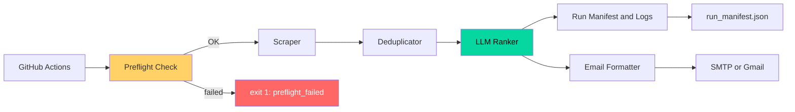

# Job Search Agent (Playwright + Claude API)

[](https://github.com/forevercornix/job-agent/actions/workflows/ci.yml)
[](LICENSE)
[](docs/testing.md)

🇱🇹 Lietuviška versija: [`README.lt.md`](README.lt.md)

| Metric            | Value                         |
| ----------------- | ----------------------------- |
| Python            | ~1,840 LOC (excluding tests)   |
| Tests             | 173                           |
| Coverage          | 92.9%                         |
| Sources           | Configurable (`sources.yaml`) |
| LLM               | Claude, tool use              |
| Parallel scraping | 3 sources                     |
| CI                | GitHub Actions                |

> 📌 **Notes that still apply after publication:**
>
> - If you use `sources.local.yaml` with real sources, check their `robots.txt`
>   and terms of service first (see `SECURITY.md`)
> - Be ready to explain **your own** architectural decisions, not just how the
>   code works

## Overview

**LLM-assisted job search automation.** The agent browses job boards with
Playwright, scores each posting against a candidate profile through the Claude
API with structured, validated output, and emails a summary — fully automated
via GitHub Actions.

**This project is set up for public/portfolio use.** By default, personal data
(search keywords, CV profile) lives in environment variables (`.env` locally) or
GitHub Secrets (Actions) rather than in code or a committed YAML file. **An
important boundary:** this depends on how *you* use the repo. `.gitignore` does
not protect a file that was already `git add`-ed, and nothing can technically
guarantee a user won't commit `.env`, logs or results by accident (see
`SECURITY.md`).

**Known limitations (top 4 — full list in `docs/limitations.md`):**

- Scrapers break when a site changes its DOM/HTML structure
- LLM scoring is not fully deterministic, even at `temperature=0`
- This tool **does not replace human judgement** — no application is ever sent
  automatically
- You must respect each source's terms of service and `robots.txt`

## Architecture


```mermaid
flowchart LR
    A[GitHub Actions] --> B[Preflight Check]
    B -->|OK| C[Scraper]
    B -->|failed| Z[exit 1: preflight_failed]
    C --> D[Deduplicator]
    D --> E[LLM Ranker]
    E --> F[Run Manifest and Logs]
    E --> G[Email Formatter]
    G --> H[SMTP or Gmail]
    F --> I[run_manifest.json]

    style Z fill:#f66,color:#fff
    style B fill:#ffd166
    style E fill:#06d6a0,color:#000
```

Six main stages: **Preflight** (fail fast if the API is unreachable) →
**Scraper** (parallel, with a circuit breaker guarding against consistently
failing sources) → **Deduplicator** (previously seen postings are never sent to
Claude again) → **LLM Ranker** (tool-calling agent with schema and grounding
validation, see `docs/llm-reliability.md`) → **Run Manifest + structured logs**
(a clear status and exit code for every run) → **Email**.

The full diagram, with intermediate data formats, a module table and error
handling, is in **`docs/architecture.md`**.

## Features

- 🤖 **LLM scoring with tool use**, not single-shot classification — Claude
  decides for itself whether the short listing summary is enough to score, or
  whether it needs to call `get_full_job_description` for the full page text
- 🎯 **LLM reliability** — JSON schema validation (in code, plus a formal
  `schemas/rank_result.schema.json` contract); the `evidence` quote is checked
  **programmatically** against the posting text, and the score is automatically
  lowered if the quote is fabricated or not found; `temperature=0` for
  consistency (see `docs/llm-reliability.md`)
- 🔍 Browses job boards **in parallel** with Playwright (headless Chromium, up
  to 3 sources at once via `ThreadPoolExecutor`) — sources are declared in
  `sources.yaml`, so **adding one requires no Python changes**
- 🔁 Automatic retry with exponential backoff for transient Claude API and
  Playwright failures (rate limits, network errors, 5xx) via `tenacity`
- 🔌 Circuit breaker per source — after 3 consecutive failed runs a source is
  skipped for 24h instead of being retried pointlessly
- 📬 Emails a summary of results, but only when there are matches
- 🔂 Skips postings already seen in earlier runs (cross-run deduplication)
- ⏰ Fully automated through GitHub Actions (daily schedule, no server)
- 🔒 Privacy-conscious by default — personal data lives in env vars/Secrets
  rather than in code (see the boundary noted above)
- 🛡️ Prompt injection mitigation — scraped listing content is clearly separated
  from instructions (`system`/`user` separation plus `<untrusted_job_posting>`
  tags)
- 🕵️ The public version ships generic demo sources (`sources.yaml`); real
  sources stay private (`sources.local.yaml`, never committed)
- 🩺 Preflight healthcheck + run manifest — cleanly distinguishes "the agent
  failed to start" from "the agent ran and found nothing new", with the correct
  exit code for CI/cron systems
- 📊 Structured JSON logging (`LOG_FORMAT=json`) for log aggregation, with a
  human-readable default locally
- 🎬 **`--demo` mode** — the full pipeline output format in under a second, with
  no API key, no internet and no browser install (`python main.py --demo`);
  verified automatically by CI on every push (see `ci.yml`)
- 💰 Cost control — seen jobs are skipped before any API call, with caps on
  characters per listing and jobs per run, and API calls logged in the manifest
  (see `docs/cost-control.md`)
- ✅ 173 tests (pytest) at 92.9% coverage, including real DOM parsing with
  Chromium and a subprocess integration test; `ruff` lint and a CI workflow (see
  `docs/testing.md`)

## Quick Start

**1. See the full output format in 30 seconds — no API key, no browser install:**

```bash
git clone https://github.com/forevercornix/job-agent.git
cd job-agent
pip install -r requirements.txt   # Python packages only — no Playwright browsers yet
python main.py --demo
```

This generates a real `demo_email_preview.html` (open it in a browser) and
`demo_matched_jobs.json` from `examples/matched_jobs.example.json` — sample but
realistic data. No `ANTHROPIC_API_KEY`, internet connection or configuration
required. This is **not** the result of real scraping or scoring; it only
demonstrates the output format so you can see the whole pipeline immediately.

**2. For a real run** (actual scraping + Claude scoring):

```bash
playwright install chromium        # a browser is needed now
cp .env.example .env
# ... set ANTHROPIC_API_KEY, SEARCH_KEYWORDS, CANDIDATE_PROFILE ...
python main.py
```

Before your first real run, **check the CSS selectors** for the sites you choose
— see **`docs/setup.md`**.

For scheduled runs (cron or GitHub Actions), email delivery and real (non-demo)
sources, see **`docs/deployment.md`**.

## Documentation

| Document | Contents |
| --- | --- |
| [`docs/setup.md`](docs/setup.md) | Installation, `.env` configuration, selector checks, adding a source |
| [`docs/deployment.md`](docs/deployment.md) | Running the agent, cron, GitHub Actions, email delivery, real sources |
| [`docs/architecture.md`](docs/architecture.md) | Full pipeline diagram, module responsibilities, run manifest, error handling |
| [`docs/llm-reliability.md`](docs/llm-reliability.md) | How AI scoring reliability is managed — schema validation, grounding, eval harness |
| [`docs/cost-control.md`](docs/cost-control.md) | Mechanisms for controlling Claude API spend |
| [`docs/testing.md`](docs/testing.md) | Running tests, measuring coverage |
| [`docs/examples.md`](docs/examples.md) | What lives in `examples/` and `eval/` |
| [`docs/scoring.md`](docs/scoring.md) | Scoring methodology and the recommended weighted scheme |
| [`docs/limitations.md`](docs/limitations.md) | Full list of known limitations, plus a legal note |
| [`prompts/ranking_prompt.md`](prompts/ranking_prompt.md) | The Claude prompt template, with grounding and determinism explained |
| [`prompts/cv_profile.md`](prompts/cv_profile.md) | How to write the candidate profile |
| [`schemas/rank_result.schema.json`](schemas/rank_result.schema.json) | Formal contract for the model's response |
| [`SECURITY.md`](SECURITY.md) | Security policy: API keys, source privacy, prompt injection, scraping ethics |

## Project Structure

```
job_agent/
├── main.py                    # Orchestration: preflight → scrape → dedupe → rank → save
├── manifest.py                # Run manifest — execution status, run_manifest.json
├── circuit_breaker.py         # Per-source circuit breaker, state persisted across runs
├── logging_config.py          # Structured (JSON/console) logging
├── scraper.py                 # Playwright browsing logic (generic, driven by sources.yaml)
├── deduplicator.py            # Duplicate removal, seen_jobs.json management
├── ranker.py                  # Claude scoring (agent loop, schema/grounding validation)
├── format_email.py            # JSON → email text/HTML
├── config.py                  # Configuration from env/.env
├── sources.yaml               # PUBLIC, generic source configuration (demo)
├── sources.local.yaml.example # Template for PRIVATE real sources
├── schemas/rank_result.schema.json
├── eval/                      # Eval harness for measuring AI scoring accuracy
├── prompts/                   # Claude prompt templates, kept separate from code
├── docs/                      # All detailed documentation (see table above)
├── examples/                  # Demo input/output data
├── tests/                     # 173 pytest tests
├── .github/workflows/         # job-search.yml (cron) + ci.yml (lint/test)
├── LICENSE                    # MIT
├── SECURITY.md
└── README.md
```

## License

MIT — see [`LICENSE`](LICENSE).
